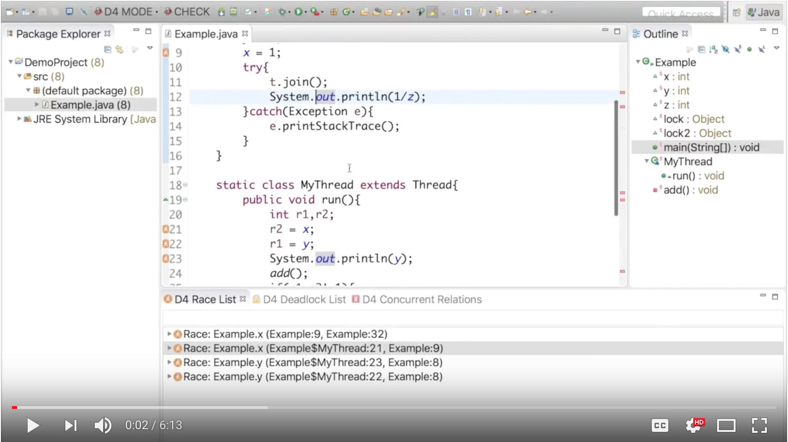

# D4: Fast Concurrency Debugging with Parallel Differential Analysis

D4 is a tool that detects data races and deadlocks interactively in the Eclipse IDE for Java. For most code changes, it finishes in less than 0.1s after the change is introduced. A video demo of D4 is available below:

[](https://www.youtube.com/watch?v=sAF4WYl7ANU&t "D4 Demo")

### Software Dependencies
- Java 1.8 to compile
- Eclipse Mars, Photon 
- Eclipse PDE
- [WALA 1.5.0](https://github.com/wala/WALA)
- [Incremental Pointer Analysis](https://github.com/april1989/Incremental_Points_to_Analysis.git)(submodule)
- [Akka](https://akka.io/) (included)

### Build and Run D4 

````git clone https://github.com/wala/WALA```` 


````git clone --recurse-submodules https://github.com/parasol-aser/D4```` 

Import all the projects into Eclipse, and launch the plugin:  ````/edu.tamu.cse.aser.d4```` -> ````MANIFEST.MF```` -> Testing -> Launch an Eclipse application. 

In the newly launched Eclipse application, right-click a main class in Package Explorer, select ASER -> D4.

The incremental detection can be triggered by saving the changed files.

** Add the following method to the ````com.ibm.wala.cast.loader.AstClass````:
```java
  public void updateMethod(Selector selector, IMethod method) {
    if (declaredMethods.containsKey(selector)) {
      declaredMethods.put(selector, method);
    } else if (getSuperclass() != null) {
      if(getSuperclass() instanceof AstClass){
        ((AstClass) getSuperclass()).updateMethod(selector,method);
      }
    }
  }
```

#### D4 views

Go to Window -> Show View -> Others to display D4 views (i.e., D4 Concurrent Relations, D4 Race List, D4 Deadlock List). 

#### Ignore certain variable or method

To exclude variables or methods from being detected by D4, right-click the variables/methods shown in the Outline view or the bugs/relations, select D4 -> Ignore This Variable/Method. To add them back, select D4 -> Consider This Variable/Method.

### D4 Docker Image
A docker image running D4 on a local machine is available, run 
````docker pull aprildocker/d4_ubuntu_java8:firsttry```` 

### Authors
Bozhen Liu, Texas A&M University

Jeff Huang, Texas A&M University

### Paper
D4 is powered by a set of parallel incremental algorithms for pointer analysis and happens-before analysis. You can find the technical details in our PLDI'18 paper. Our incremental pointer analysis code has also been integrated into the popular [WALA](https://github.com/april1989/Incremental_Points_to_Analysis.git) framework.

If you use this resource, please cite our paper: 

[PLDI'18] "[D4: Fast Concurrency Debugging with Parallel Differential Analysis](https://parasol.tamu.edu/~jeff/academic/d4.pdf)"
